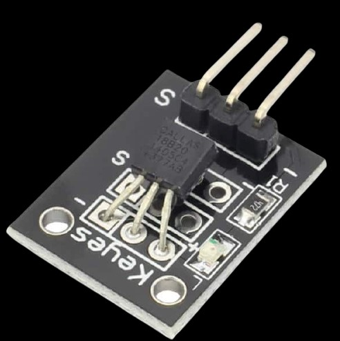
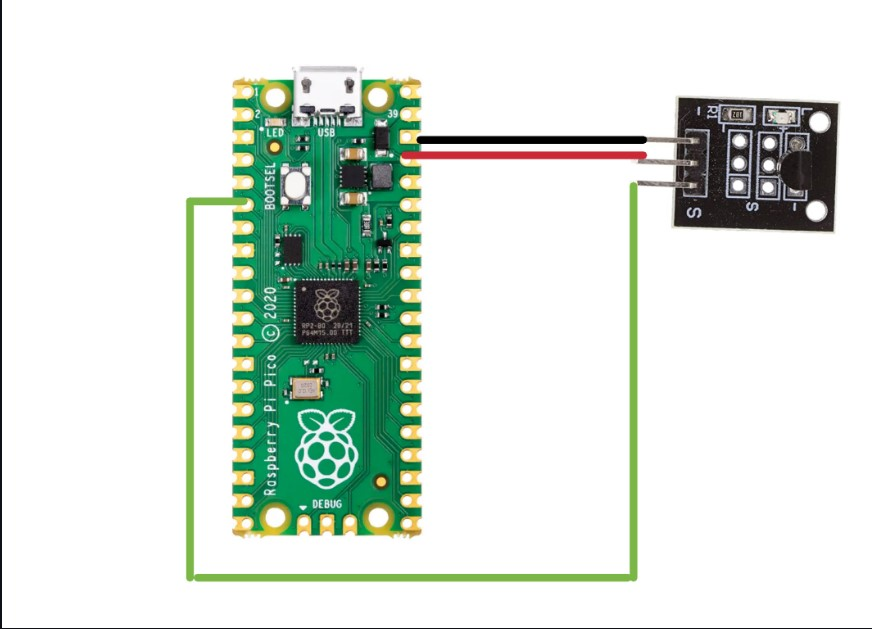

Sensor Ky-001 

INFORMACIÓN

El Sensor de Temperatura Digital KY-001 es un módulo con un sensor de temperatura ambiente (DS18B20) entregando información mediante un bus (One Wire) de datos serie digital , un LED y una resistencia .Es compatible con Raspberry Pi , Arduino, y Esp8266.

El Sensor de Temperatura Digital es útil para la lectura de la temperatura de lo que desees, por ejemplo una habitación, el coche, maquinas para procesos de monitoreo y control.




<h2>Diagrama</h2>



## Codigo
```python
import machine, onewire, ds18x20, time

ds_pin = machine.Pin(16)
ds_sensor = ds18x20.DS18X20(onewire.OneWire(ds_pin))
roms = ds_sensor.scan()

while True:
    ds_sensor.convert_temp()
    time.sleep_ms(500)
    for rom in roms:
        print(ds_sensor.read_temp(rom))
    time.sleep(1)
   ```
## Resultados

