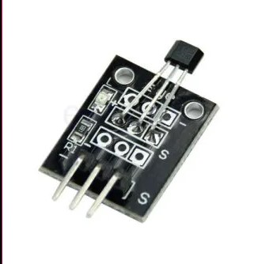
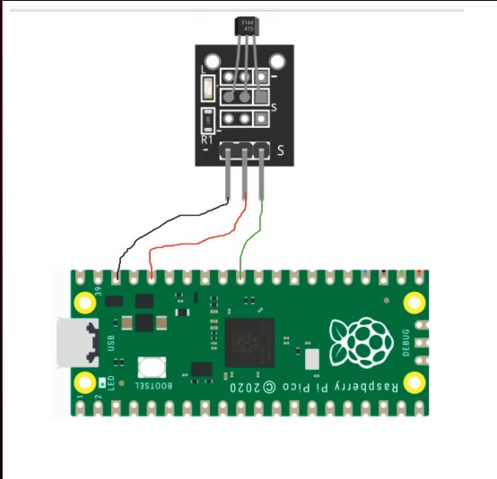
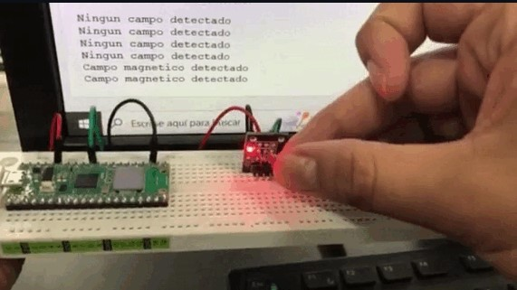

Sensor kY-003 Hall Magnetic

INFORMACIÓN

El Sensor Magnético KY-003 es un módulo que integra un sensor magnético de Efecto Hall con salida digital. Permite detectar de forma fácil, rápida y precisa campos magnéticos producidos cerca de sensor.

El El Sensor Magnético KY-003 es muy útil en proyectos de electrónica, robótica y automatización por ejemplo: para medir posiciones sin  tener contacto, un contador de ciclos, es muy común verlos en aplicaciones como velocímetros sobre todo en bicicletas.

<h2>Diagrama</h2>

<h2>Codigo</h2>
import machine
from machine import Pin
import time

iman=Pin(26,Pin.IN)

while True:
    if iman.value() == 0:
        print("Campo magnetico detectado")
    elif iman.value()==1:
        print("Ningun campo detectado")
    time.sleep(1)
<h2>Resultado</h2>

