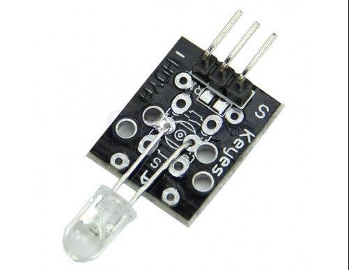
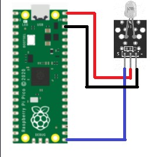

Sensor KY-005 IR EMISSION


INFORMACIÓN

El Sensor Infrarrojo Emisor es un módulo KY-005 también llamado diodo emisor infrarrojo es un modulo que convierte la energía eléctrica en luz infrarroja a una frecuencia de 38KHz y una longitud de onda de 940 nm esto se encuentra fuera del espectro detectable por humanos. Consiste en un led IR de 5mm funciona generalmente en conjunto con el receptor de infrarrojo KY-022.

El Sensor Infrarrojo Emisor es útil cuando se requiere controlar objetos a distancia por ejemplo: aplicaciones de control remoto, barreras fotoeléctricas, detección de objetos.




<h2>Diagrama</h2>



## Codigo
```python
from machine import Pin
import time

pico_led = Pin(25, Pin.OUT)
ir = Pin(15, Pin.OUT)
receiver = Pin(16, Pin.IN)


while True:
    # Se prende el sensor para que siempre
    # este emitiendo luz infraroja
    ir.value(1)
    

    print(receiver.value())
    
    if(receiver.value() == 1):
        pico_led.value(1)
    else:
        pico_led.value(0)
        
    time.sleep(1)
```
## Resultados


