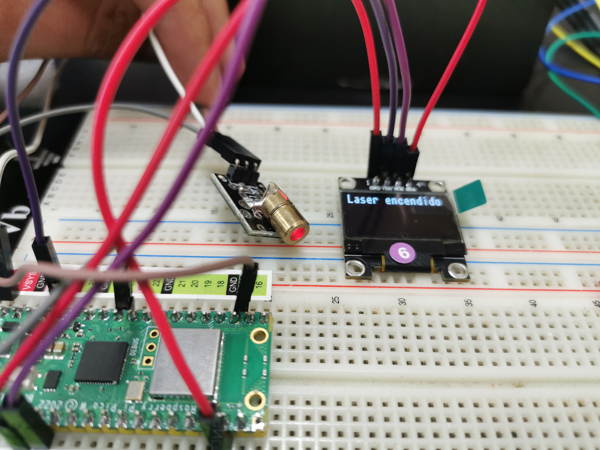
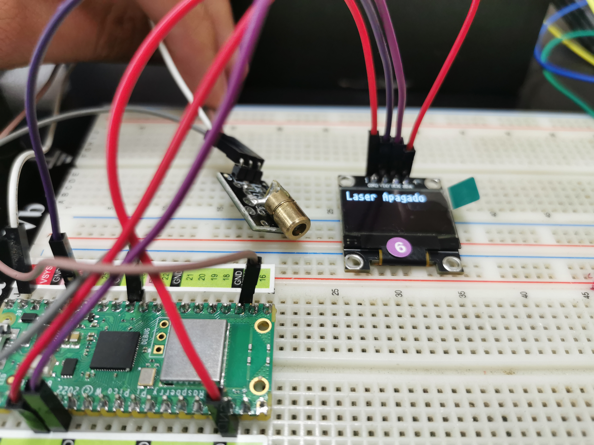

# KY-008 LASER EMIT

## OBJETIVO:

Encender el sensor laser usando la pico W

## CÓDIGO:

```python
from machine import Pin, I2C
import time
import ssd1306

laser = Pin(26, Pin.OUT)
DisplayOn="Laser encendido"
DisplayOff="Laser Apagado"
i2c = machine.I2C(0, sda=machine.Pin(4), scl=machine.Pin(5))
oled = ssd1306.SSD1306_I2C(128, 32, i2c)

try:
   while True:
        oled.fill(0)
        oled.text(DisplayOn, 0, 0)
        laser.on()
        oled.show()
        time.sleep_ms(500)
        oled.fill(0)
        oled.text(DisplayOff, 0, 0)
        oled.show()
        laser.off()    
        time.sleep_ms(500)
    
except:
    print("no se imprimió")
    

```

### PRUEBAS:




