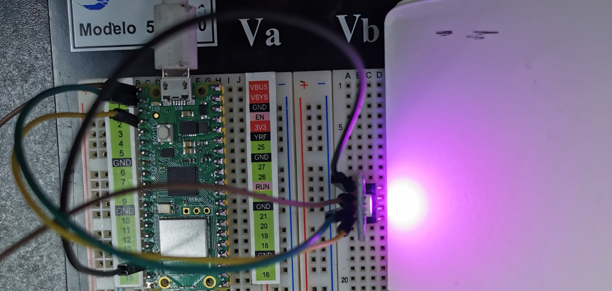
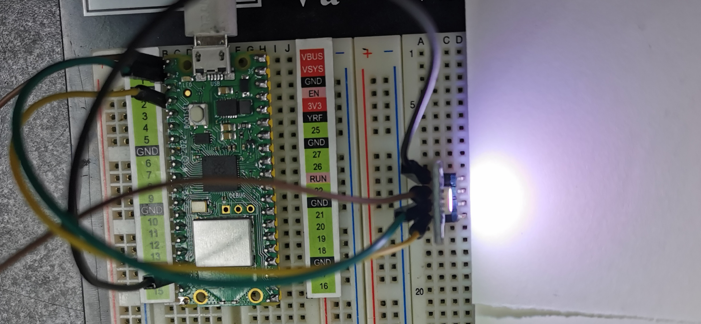
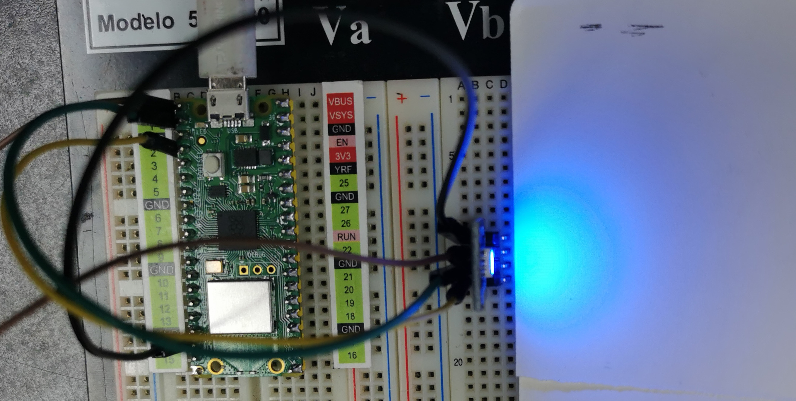
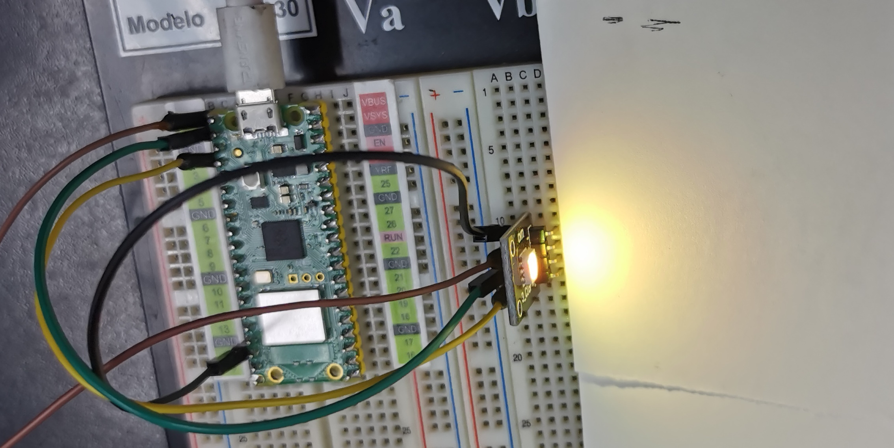

# KY-039 SMD RGB

## OBJETIVO:

Encender diferentes colores en el led

## CÓDIGO:

```python
import machine
import utime

# Configurar los pines GPIO para el control de los colores RGB
pin_red = machine.Pin(0, machine.Pin.OUT)
pin_green = machine.Pin(1, machine.Pin.OUT)
pin_blue = machine.Pin(2, machine.Pin.OUT)

def set_color(red, green, blue):
    pin_red.value(red)
    pin_green.value(green)
    pin_blue.value(blue)

# Llamada al metodo combinando colores
while True:
    # Amarillo
    set_color(1, 1, 0)
    utime.sleep(1)

    # Purpura
    set_color(0, 1, 1)
    utime.sleep(1)

    # Cyan
    set_color(1, 0, 1)
    utime.sleep(1)
    
    # Blanco
    set_color(1, 1, 1)
    utime.sleep(1)
    
    # Azul
    set_color(0, 0, 1)
    utime.sleep(1)

```

### PRUEBAS:







