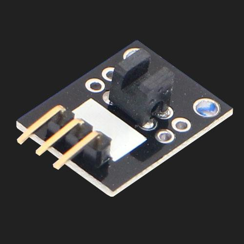
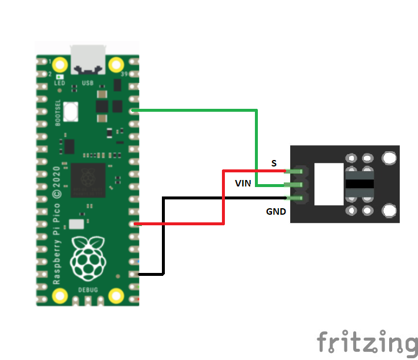
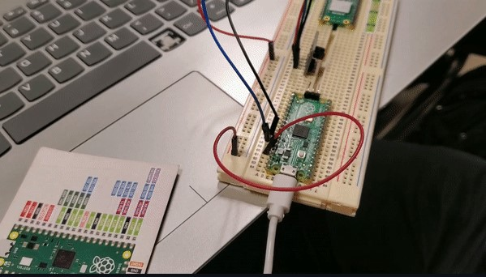

Sensor Ky-010 

INFORMACIÓN

El Sensor Foto Interruptor Módulo KY-010 es un fotosensor , es decir, un módulo de barrera de luz que combina dos partes: trasmisión y de recepción. De un lado tiene el emisor y enfrente un receptor que cuando se interrumpe la luz infrarroja manda una señal a Arduino,Esp8266, Raspberry y/u otro microcontrolador que se este usando.

El Sensor Foto Interruptor Módulo KY-010 se utilizan para detectar la velocidad de un giro de un motor u objeto que interrumpa la luz infrarroja; se puede utilizar para el cierre de una puerta con una sencilla programación y para algunos desplazamientos de máquinas.

<h2>Diagrama</h2>

## Resultado
Cuando se interrumpe la barrera del módulo, también se interrumpe la señal proveninente del propio módulo.

En este ejemplo se configuro que al momento que le diera la luz se prediera el led de la pico, mientras que no le de la luz tan fuerte, se apagara el led.

