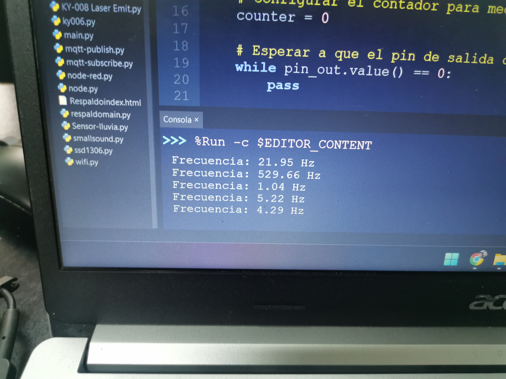
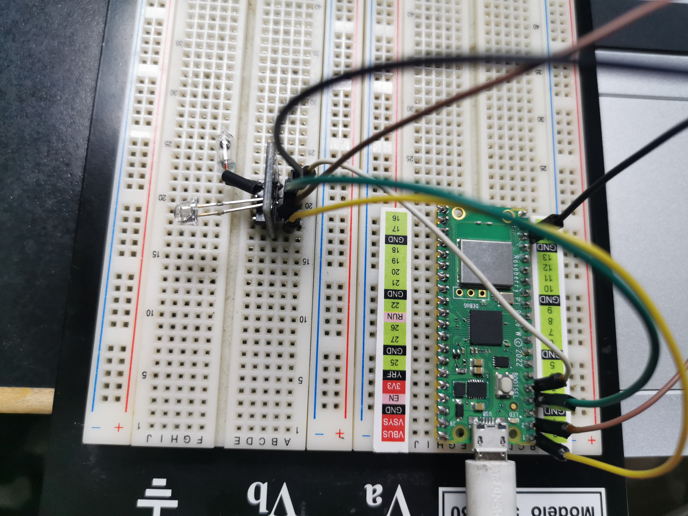
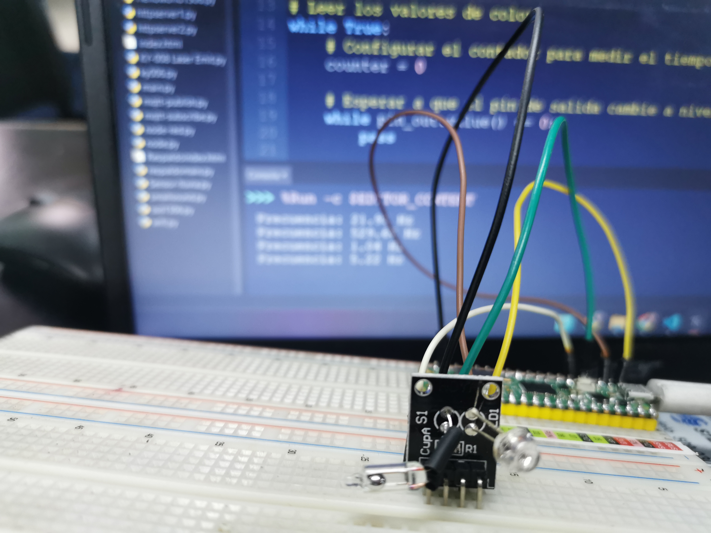

# KY-039 SMD RGB

## OBJETIVO:

Encender diferentes colores en el led

## CÓDIGO:

```python
import machine
import utime

# Configurar los pines GPIO
pin_s0 = machine.Pin(0, machine.Pin.OUT)
pin_s1 = machine.Pin(1, machine.Pin.OUT)
pin_out = machine.Pin(2, machine.Pin.IN)

# Configurar la ganancia de frecuencia del sensor
pin_s0.value(0)  # Configurar S0 a nivel bajo
pin_s1.value(1)  # Configurar S1 a nivel alto

# Leer los valores de color
while True:
    # Configurar el contador para medir el tiempo de pulso alto
    counter = 0

    # Esperar a que el pin de salida cambie a nivel alto
    while pin_out.value() == 0:
        pass

    # Contar el tiempo de pulso alto
    while pin_out.value() == 1:
        counter += 1
        utime.sleep_us(10)

    # Calcular la frecuencia a partir del tiempo de pulso alto
    frequency = 1000000 / counter

    print("Frecuencia: {:.2f} Hz".format(frequency))
    utime.sleep(1)


```

### PRUEBAS:





