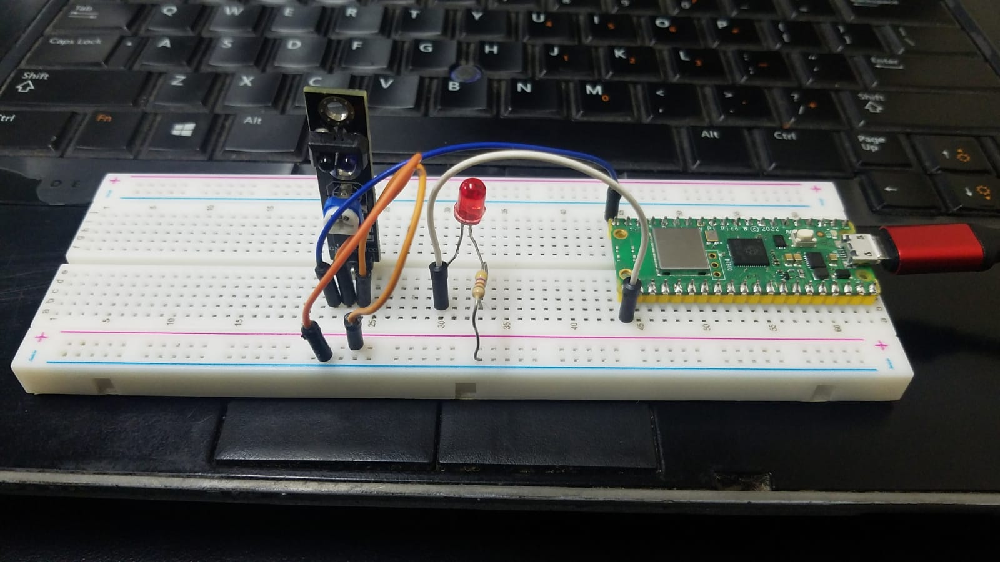

¿Para qué sirve?
<br>
El Sensor de Obstáculos Módulo KY-033 te permitirá realizar una detección de línea de forma fácil, rápida y precisa, es compatible con cualquier microcontrolador que posea un pin de 5 V.
<br>
El Sensor de Obstáculos KY-033 infrarrojo o detector de línea es un dispositivo que detecta la presencia de un objeto mediante la reflexión que produce en la luz. El uso de luz infrarroja (IR) es simplemente para que esta no sea visible para los humanos. Actúa a distancias cortas, típicamente de 2 a 40 cm.


## CODIGO
```python
#Se importan las librerías de micropython para la configuración del sensor.
from machine import Pin
import time

#Se configura el pin GPIO3 como entrada digital
sensor = Pin(3, Pin.IN, Pin.PULL_UP)

#Entra en el loop infinito donde se lee el estado y muestra un mensaje en consola dependiendo el valor obtenido
while True:
    if sensor.value() == 0:
        print("0   Blanco")
    else:
        print("1   Negro")
        #Se espera 0.1 segundos para realizar otra lectura
    time.sleep(0.1)
```


