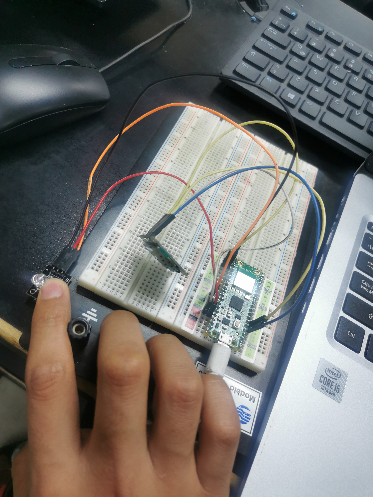

# KY-039 Heartbeat

## OBJETIVO:

Contar el pulso cardíaco y mostrarlo de manera digital

## CÓDIGO:

```python
import machine
import ssd1306
import time

# Configuración de pines para la pantalla OLED
i2c = machine.I2C(0, sda=machine.Pin(4), scl=machine.Pin(5))
oled = ssd1306.SSD1306_I2C(128, 32, i2c)

# Configuración de pin para el sensor de pulso KY-039
sensor_pin = machine.Pin(26, machine.Pin.IN)

def read_pulse():
    pulse_count = 0
    last_pulse_time = 0
    while True:
        if sensor_pin.value() == 1 and time.ticks_ms() - last_pulse_time > 200:
            pulse_count += 1
            last_pulse_time = time.ticks_ms()
            oled.fill(0)
            oled.text("Pulsos:", 0, 0)
            oled.text(str(pulse_count), 0, 20)
            oled.show()

# Llamada a la función para comenzar a leer el pulso
read_pulse()


```

### PRUEBAS:




